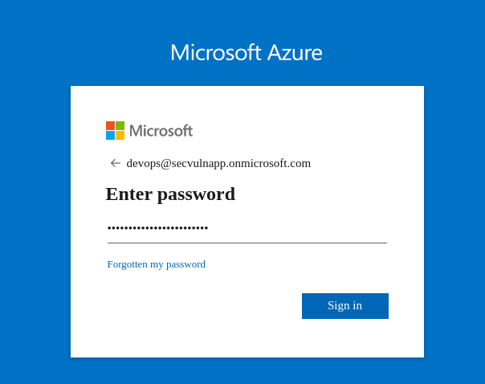
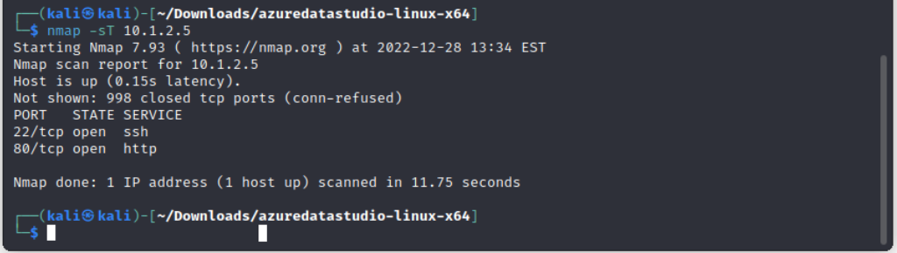

###Challenge 1
Browse to [brokenazure.cloud](brokenazure.cloud) in burp, and you'll notice there's several html files that get loaded. If you click on the header.html request, you'll see that the banner image is hosted on an azure storage account.


As this is the first challenge, there's a good chance this storage account is unprotected. Lets connect to https://supercompanystorage.blob.core.windows.net/storagecontainer with Azure Storage Explorer:


The name of the .PEM file is the flag: SECURA{C3RT1F1C3T3}
The storage account seems to have an employee VPN configuration as well, so its likely the config and .PEM can be used for the next challenge.

###Challenge 2
https://www.brokenazure.cloud/am1b3176321b173g183721ba73/index.html

If we crack open the .PEM file in a text editor, we can see that it contains a tenant and app id:
```
-----BEGIN AZURE_DETAILS-----
Tenant id: 4452edfd-a89d-43aa-8b46-a314c219cc50
App-id: b2bfb506-aead-40d8-9e93-6f3e5d752826
-----END AZURE_DETAILS-----
```

We can collect some more information about the tenant:
https://login.microsoftonline.com/4452edfd-a89d-43aa-8b46-a314c219cc50/.well-known/openid-configuration


The .PEM also contains the private key for the tenant. The following command returns nothing so there's no password on the file:
`openssl rsa -in <.pem> -noout`


So we have the tenant ID and we have the PEM, so lets try and authenticate with the service principal:
`az login --service-priincipal -u --tenant 4452edfd-a89d-43aa-8b46-a314c219cc50 -p "SECURA{C3RT1F1C3T3}.pem"`


Use the app id as the service principal user, and we'll get a permission error for the user:
```
> az login --service-principal -u b2bfb506-aead-40d8-9e93-6f3e5d752826 --tenant 4452edfd-a89d-43aa-8b46-a314c219cc50 -p "SECURA{C3RT1F1C3T3}.pem" --verbose
No subscriptions found for b2bfb506-aead-40d8-9e93-6f3e5d752826.
```

Hmmm, okay. After some googling, this error means that the user (appid) has no permissions or IAM allocated. After looking through `az login --help`, we see the `--allow-no-subscriptions` option:

```> az login --service-principal -u b2bfb506-aead-40d8-9e93-6f3e5d752826 --tenant 4452edfd-a89d-43aa-8b46-a314c219cc50 -p "SECURA{C3RT1F1C3T3}.pem" --allow-no-subscriptions
[
  {
    "cloudName": "AzureCloud",
    "id": "4452edfd-a89d-43aa-8b46-a314c219cc50",
    "isDefault": true,
    "name": "N/A(tenant level account)",
    "state": "Enabled",
    "tenantId": "4452edfd-a89d-43aa-8b46-a314c219cc50",
    "user": {
      "name": "b2bfb506-aead-40d8-9e93-6f3e5d752826",
      "type": "servicePrincipal"
    }
  }
]
```
So now we know the account has some level of access. However, not being an azure expert, I had no idea what could possibly be relevant to look for after running `az ad sp list`, so I had to use the hint which was: `az ad user list`:
```
> az ad user list
[
  {
    "businessPhones": [],
    "displayName": "DevOps",
    "givenName": null,
    "id": "fd871932-d592-4791-989b-53dd81f8c9e5",
    "jobTitle": null,
    "mail": null,
    "mobilePhone": null,
    "officeLocation": "Password temp changed to SECURA{D4F4ULT_P4SSW0RD}",
    "preferredLanguage": null,
    "surname": null,
    "userPrincipalName": "devops@secvulnapp.onmicrosoft.com"
  },
  ...
```

Flag: SECURA{D4F4ULT_P4SSW0RD}.

###Challenge 3
https://www.brokenazure.cloud/b87312j321h321312hdsajhdjd/index.html

We have a set of creds from the last challenge, so lets try to login to azure with them:

Success!

Spent some time trying to connect over RDP to VM, and connect to the VPN, neither of which worked. After some digging around I discovered app functions, and then found that you can upload code in these functions. Inspecting the code for the GetDbConnection function app found us something interesting:


Flag: SECURA{C0NN3CT10N_STR1NG}

###Challenge 4
https://www.brokenazure.cloud/c839213j213j1h421321hj3219/index.html


The code in the previous challenge gives us a db server on port 1433. This is a SQL server port, so download azure data studio so that we can connect to it with the credentials in the string:
https://learn.microsoft.com/en-us/sql/azure-data-studio/download-azure-data-studio?view=sql-server-2017

Server: securavulnerableserver.database.windows.net
Username: DevOps
Password: SECURA{C0NN3CT10N_STR1NG}


There is only one db table, I just ran a default query that shows top 1000 results


Flag: SECURA{VPN_CR3D3NT14LS}

###Challenge 5
https://www.brokenazure.cloud/drm0s7q6nhhvxk8e57yqvhd814/index.html

Use the previous flag as the vpn password for the ovpn file from the file share in challenges 1


Earlier I noticed that there was a VM that only had an internal IP. There was only one VPN configured for the whole network so presumably we can try to connect to that VM. Find the IP/other info first:


Port scan the host to see what's open:


There's a web server on port 80. Lets connect to it in the browser:


Flag: SECURA{1NT3RN4L_HTML_W3BP4G3}

**Links:**
https://securitycafe.ro/2022/04/29/pentesting-azure-recon-techniques/